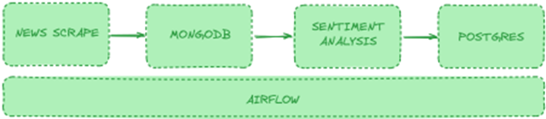

# FINNHUB-PIPELINE 

Hello I'm Muhammad Fauzan. 
Have a nice day (:

## To do list
1. Sign Up Finnhub https://finnhub.io/docs/api/symbol-search 
2. Sign Up/Login to MongoDB Atlas and create cluster or use existing cluster: https://cloud.mongodb.com 
3. Copy and paste this Airflow Docker compose to docker-compose.yaml: https://shrib.com/#Phillip3yM6o5k 
4. Create new database in Postgres Airflow to load output table 
5. Create Python code to load news from finnhub to MongoDB Atlas 
6. Create Python code to analyze news from MongoDB and load it to Postgres 7. Schedule the point 5 and  6 using Airflow DAG

## step by step
1. Run Airflow using docker-compose up
2. Create Plugins:
    -   Finnhub loader
    -   MongoDB loader
    -   Sentiment Analysis
    -   Postgres loader
3. Create python code to extract from Finnhub and load to MongoDB
4. Create Python code that Get data from MongoDB and do Sentiment Analysis then load the result to Postgres